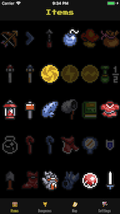

# Randorganizer

   

`Randorganizer` is an item, dungeon, and location tracker for the [Zelda: A Link to the Past randomizer](http://vt.alttp.run/). This tracker is based heavily on the [Stumpy tracker by Wolfman2000](https://stumpy.nfshost.com/). It shares much of the logic and functionality. As of right now `Randorganizer` does not support keysanity or entrance/boss shuffles.

## Requirements

- iOS 10.0+
- Xcode 9.2+

## Bootstrapping

This project uses [Carthage](https://github.com/Carthage/Carthage) to manage dependencies. In order to build the project, you must first execute:


```bash
carthage bootstrap --platform ios
```

Then open the file in Xcode

## TODO

- Add Keysanity support
- Add swordless support